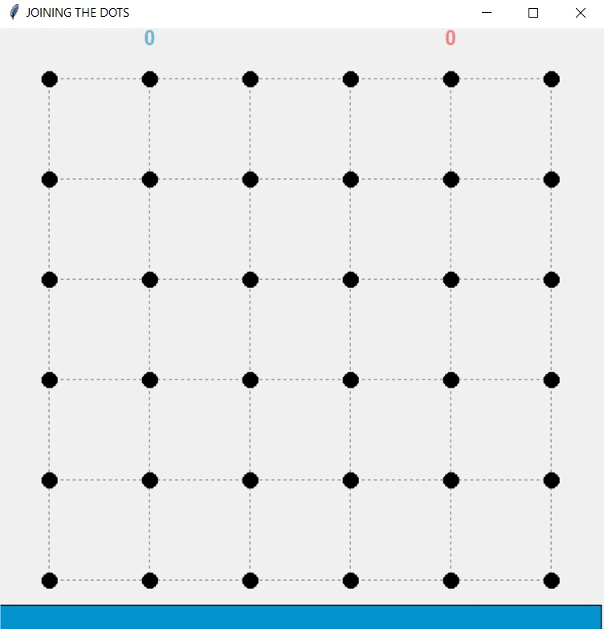
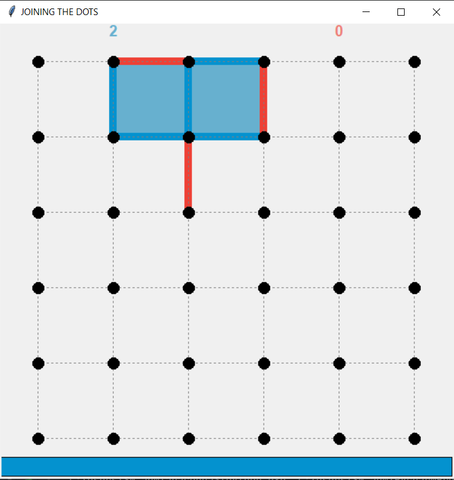
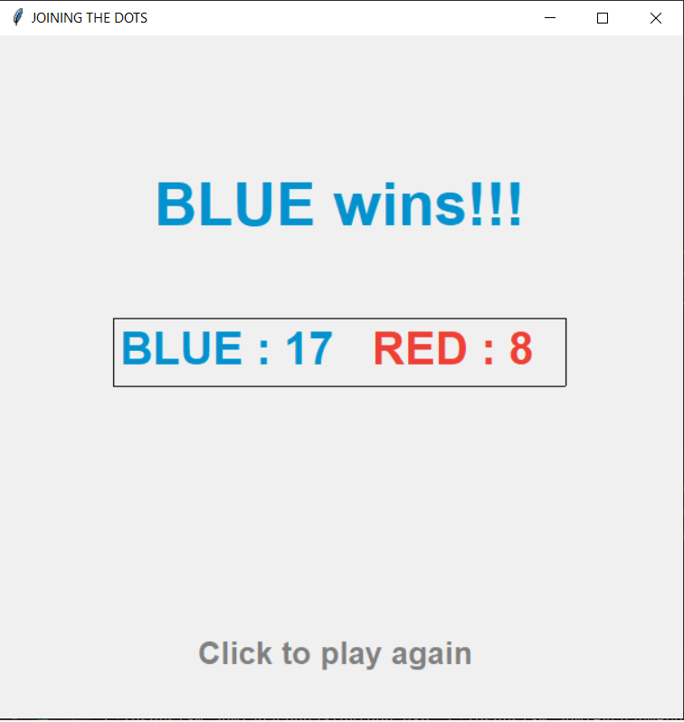

# JOINING THE DOTS
This is a 2 player game where you have to mark edges and form closed squares to get points.
The player having more number of points wins the game.

## Controls
1:Blue player starts the game 
2:Mark the edges 
3:If some player mark the edges which leads to a 4 sided closed box then that player will get 1 point and a extra chance. 
4:Player with higher score wins the game. 

Inspired by:-https://github.com/aqeelanwar/Dots-and-Boxes
